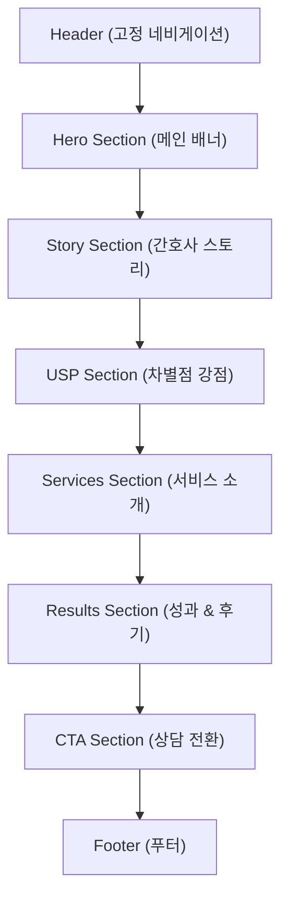

# 실버볼 마케팅 랜딩페이지 — 개발기획서

> **문서 작성일**: 2026-03-05  
> **프로젝트명**: 실버볼 마케팅 (Silverball Marketing)  
> **유형**: 마케팅 대행사 원페이지 랜딩사이트  
> **상태**: 디자인 파일 분석 완료

---

## 1. 프로젝트 개요

### 1.1 서비스 소개

**실버볼 마케팅**은 10년 이상의 간호사 임상 경험을 가진 대표가 운영하는 **전문직 특화 네이버 마케팅 대행사**입니다.  
"진단 → 계획 → 수행 → 평가"라는 간호 프로세스를 마케팅에 이식하여, 병원·상담센터·학원 등 전문직 고객을 대상으로 차별화된 서비스를 제공합니다.

### 1.2 사이트 목적

| 목적 | 설명 |
|------|------|
| **브랜드 인지** | 간호사 출신 마케터라는 고유 포지셔닝 전달 |
| **신뢰 구축** | 성과 데이터(300% 트래픽 상승, 50+ 고객사)와 고객 후기로 사회적 증거 제시 |
| **전환(리드 생성)** | 카카오톡 오픈채팅 → 무료 마케팅 진단 상담 연결 |

### 1.3 타겟 사용자

- 병원(한의원, 피부과, 치과 등) 원장·실장
- 심리상담센터 대표
- 학원 대표
- 기타 전문직 자영업자

---

## 2. 기술 스택

| 카테고리 | 기술 | 버전 |
|----------|------|------|
| **프레임워크** | Next.js (App Router) | 16.1.6 |
| **언어** | TypeScript | 5.7.3 |
| **UI 라이브러리** | React | 19.2.4 |
| **스타일링** | TailwindCSS 4 + PostCSS | 4.2.0 |
| **컴포넌트 라이브러리** | Radix UI (shadcn/ui 기반) | 다수 패키지 |
| **애니메이션** | Framer Motion | 11.18.0+ |
| **아이콘** | Lucide React | 0.564.0 |
| **폰트** | Pretendard Variable (CDN) | 1.3.9 |
| **애널리틱스** | Vercel Analytics | 1.6.1 |
| **배포** | Vercel (추정) | — |

---

## 3. 페이지 구조 (정보 아키텍처)

싱글 페이지 구조로, 아래 순서대로 섹션이 배치됩니다:



---

## 4. 섹션별 상세 사양

### 4.1 Header (고정 네비게이션)

| 항목 | 내용 |
|------|------|
| **파일** | [header.tsx](file:///c:/Users/고은실/OneDrive/바탕%20화면/b_7yaXx5UWYro-1772708494212/components/header.tsx) |
| **위치** | `position: fixed`, 상단 고정, `z-index: 50` |
| **배경** | 반투명 배경 (`bg-background/80`) + `backdrop-blur-md` |
| **로고** | 청진기(Stethoscope) 아이콘 + "실버볼" 텍스트 |

**네비게이션 메뉴:**

| 메뉴 | 앵커 링크 |
|------|-----------|
| 스토리 | `#story` |
| 강점 | `#usp` |
| 서비스 | `#services` |
| 성과 | `#results` |
| **무료 상담** (CTA 버튼) | `#contact` |

**반응형 동작:**
- **Desktop (md 이상)**: 가로 네비게이션 바 표시
- **Mobile (md 미만)**: 햄버거 메뉴 → Framer Motion `AnimatePresence`로 드롭다운 슬라이드 애니메이션

---

### 4.2 Hero Section (메인 배너)

| 항목 | 내용 |
|------|------|
| **파일** | [hero-section.tsx](file:///c:/Users/고은실/OneDrive/바탕%20화면/b_7yaXx5UWYro-1772708494212/components/hero-section.tsx) |
| **높이** | `min-h-screen` (전체 화면) |
| **배경** | `bg-primary` (#1e293b, 다크 네이비) |
| **배경 패턴** | SVG 그리드 패턴 (40x40, 흰색 선, opacity 4%) |
| **장식 요소** | 오른쪽 상단 소프트 글로우 (secondary/10, blur-3xl) |

**콘텐츠 구조:**

```
┌─────────────────────────────────────────┐
│        ● 간호사 면허 보유 마케터          │  ← 배지 (secondary 톤)
│                                         │
│      10년 차 간호사가                    │
│      당신의 비즈니스를 간호합니다.         │  ← h1 메인 카피
│                                         │
│  생명을 다루던 정교함으로 설계하는         │
│  전문직 전용 네이버 유입 구조, 실버볼 마케팅 │  ← 서브 카피
│                                         │
│  [ 무료 마케팅 진단 받기 → ]  [ 포트폴리오 ]│  ← CTA 버튼 2개
│                                         │
│  ┌────────────────────────────────────┐  │
│  │  13+           300%          50+   │  │
│  │ 임상경험(년)  평균트래픽상승  전문직고객사│  │  ← 통계 바
│  └────────────────────────────────────┘  │
└─────────────────────────────────────────┘
```

**애니메이션 (Framer Motion):**

| 요소 | 효과 | 딜레이 |
|------|------|--------|
| 배지 | fadeIn + slideUp(20px) | 0s |
| h1 타이틀 | fadeIn + slideUp(30px) | 0.15s |
| 서브카피 | fadeIn + slideUp(30px) | 0.3s |
| CTA 버튼 | fadeIn + slideUp(30px) | 0.45s |
| 통계 바 | fadeIn + slideUp(40px) | 0.6s |

**CTA 버튼:**

| 버튼 | 스타일 | 링크 |
|------|--------|------|
| 무료 마케팅 진단 받기 | `bg-secondary` (하늘색 계열), 화살표 아이콘 | `#contact` |
| 포트폴리오 보기 | outline 스타일, 서류가방 아이콘 | `#services` |

---

### 4.3 Story Section (간호사 스토리)

| 항목 | 내용 |
|------|------|
| **파일** | [story-section.tsx](file:///c:/Users/고은실/OneDrive/바탕%20화면/b_7yaXx5UWYro-1772708494212/components/story-section.tsx) |
| **배경** | `bg-background` (흰색) |
| **앵커 ID** | `#story` |
| **타이틀** | "왜 간호사가 마케팅을 하나요?" |

**프로세스 모델 (4단계):**

| 단계 | 번호 | 간격 |
|------|------|------|
| 진단 | ① | → |
| 계획 | ② | → |
| 수행 | ③ | → |
| 평가 | ④ | |

- 원형 아이콘(숫자) `bg-primary` + 화살표 구분자
- Desktop: 4열 그리드 / Mobile: 2열 그리드

**타임라인 카드 (3개):**

| 카드 | 아이콘 | 제목 | 설명 |
|------|--------|------|------|
| 1 | HeartPulse | 호스피스 병동 | 진정한 공감의 기술 → 마케팅 핵심 |
| 2 | Brain | 정신건강의학과 | 심리/행동 패턴 분석 → 소비자 심리 분석 |
| 3 | ClipboardList | 간호 실습 지도자 | 교육 프로그램 설계 → 마케팅 전략 설계 |

- 카드 스타일: `rounded-2xl`, `border`, `bg-card`, hover 시 `shadow-lg` + `border-primary/20`
- 아이콘 박스: `rounded-xl`, `bg-secondary`

---

### 4.4 USP Section (차별점/강점)

| 항목 | 내용 |
|------|------|
| **파일** | [usp-section.tsx](file:///c:/Users/고은실/OneDrive/바탕%20화면/b_7yaXx5UWYro-1772708494212/components/usp-section.tsx) |
| **배경** | `bg-muted` (#f1f5f9, 라이트 그레이) |
| **앵커 ID** | `#usp` |
| **타이틀** | "왜 실버볼이어야 하나요?" |

**USP 카드 (3개):**

| 카드 | 아이콘 | 하이라이트 태그 | 제목 |
|------|--------|----------------|------|
| 1 | Eye | 전문직 심리 분석 | 전문가적 시선 |
| 2 | ShieldCheck | 리스크 제로 | 의료법 준수 |
| 3 | GitMerge | 유입-확신-전환 동선 | 통합 구조 설계 |

**카드 특수 디자인:**
- 좌측에 세로 액센트 라인 (`w-1 bg-primary`, hover 시 `w-1.5`)
- 하이라이트 태그: `bg-secondary`, 작은 뱃지 형태

---

### 4.5 Services Section (서비스 소개)

| 항목 | 내용 |
|------|------|
| **파일** | [services-section.tsx](file:///c:/Users/고은실/OneDrive/바탕%20화면/b_7yaXx5UWYro-1772708494212/components/services-section.tsx) |
| **배경** | `bg-background` (흰색) |
| **앵커 ID** | `#services` |
| **타이틀** | "맞춤형 마케팅 서비스" |

**서비스 카드 (3개):**

| 카드 | 아이콘 | 서비스명 | Featured |
|------|--------|----------|----------|
| 1 | PenLine | 브랜드 블로그 | ✗ |
| 2 | MapPin | 스마트플레이스 최적화 | ✓ (BEST 뱃지) |
| 3 | Users | 체험단 & 컨설팅 | ✗ |

**Featured 카드 차이점:**
- 일반: `border-border bg-card` (흰색 카드)
- Featured: `border-primary bg-primary text-primary-foreground` (다크 배경) + 상단 "BEST" 뱃지

**각 카드 공통 구조:**
1. 아이콘 박스 (12×12, `rounded-xl`)
2. 서비스명 (h3, `text-xl font-bold`)
3. 서비스 설명 (텍스트)
4. 기능 목록 (체크 아이콘 + 텍스트 × 4항목)
5. "자세히 보기" CTA 버튼

**카드별 세부 기능:**

````carousel
**브랜드 블로그**
- 전문직 타겟 키워드 리서치
- SEO 최적화 원고 작성
- 전문성과 공감의 밸런스
- 정기 성과 리포트
<!-- slide -->
**스마트플레이스 최적화** ⭐ BEST
- 지역 키워드 상위 노출
- 플레이스 프로필 최적화
- 리뷰 관리 전략
- 전환율 극대화 설계
<!-- slide -->
**체험단 & 컨설팅**
- 타겟 맞춤 체험단 기획
- 인플루언서 매칭
- 1:1 마케팅 전략 수립
- 실행 가능한 액션 플랜
````

---

### 4.6 Results Section (성과 & 후기)

| 항목 | 내용 |
|------|------|
| **파일** | [results-section.tsx](file:///c:/Users/고은실/OneDrive/바탕%20화면/b_7yaXx5UWYro-1772708494212/components/results-section.tsx) |
| **배경** | `bg-muted` (라이트 그레이) |
| **앵커 ID** | `#results` |
| **타이틀** | "숫자가 증명하는 실력" |

**성과 통계 카드 (4개, 2×2 → lg: 4열):**

| 지표 | 값 | 아이콘 |
|------|----|--------|
| 블로그 방문자 상승 | 300% | TrendingUp |
| 지역 키워드 점유 | 1위 | MapPin |
| 고객 만족도 | 98% | Star |
| 성공 사례 | 50+ | MessageSquare |

**숫자 카운팅 애니메이션 (`AnimatedCounter`):**
- `IntersectionObserver` (threshold: 0.5)로 뷰포트 진입 감지
- `framer-motion`의 `useMotionValue` + `animate`로 0에서 목표값까지 2초간 easeOut 카운트업
- 한 번만 실행 (`observer.disconnect()`)

**고객 후기 (6개, 2열 → lg: 3열):**

| 후기 | 작성자 |
|------|--------|
| 블로그 일 방문자 500명 돌파 | OO 한의원 원장님 |
| 의료법 걱정 없는 마케팅 | OO 피부과 실장님 |
| 예약 전환 2배 이상 증가 | OO 상담센터 대표님 |
| 우리 분야 이해하는 대행사 | OO 심리상담소 원장님 |
| 실행 가능한 구체적 플랜 | OO 학원 대표님 |
| 체험단 타겟 맞춤 운영 | OO 치과 마케팅 담당자님 |

- 각 후기에 ⭐⭐⭐⭐⭐ (5개 별점) 표시 (`fill-[#facc15]`)
- staggered 애니메이션: 0.08s 간격의 딜레이

---

### 4.7 CTA Section (전환 유도)

| 항목 | 내용 |
|------|------|
| **파일** | [cta-section.tsx](file:///c:/Users/고은실/OneDrive/바탕%20화면/b_7yaXx5UWYro-1772708494212/components/cta-section.tsx) |
| **배경** | `bg-primary` (다크 네이비) |
| **앵커 ID** | `#contact` |
| **배경 패턴** | SVG 도트 패턴 (60x60, r=1.5, opacity 3%) |

**콘텐츠:**
- 배지: 청진기 아이콘 + "무료 마케팅 진단"
- h2: "대표님의 서비스가 / 검색창에서 고객을 만나게 하세요."
- 서브카피: 간호사 면허 보유 마케터 직접 진단 안내

**CTA 버튼:**

| 버튼 | 스타일 | 동작 |
|------|--------|------|
| 카카오톡 상담 연결 | 카카오 노란색 (`#fee500`), `font-bold` | 외부 링크 (`open.kakao.com`), `target="_blank"` |
| 서비스 둘러보기 | outline, 흰색 텍스트 | `#services` 앵커 이동 |

---

### 4.8 Footer (푸터)

| 항목 | 내용 |
|------|------|
| **파일** | [footer.tsx](file:///c:/Users/고은실/OneDrive/바탕%20화면/b_7yaXx5UWYro-1772708494212/components/footer.tsx) |
| **배경** | `bg-background` + 상단 border |

**레이아웃: 4열 그리드 (md 이상)**

| 열 | 내용 |
|----|------|
| 1 (브랜드) | 로고 + 브랜드 설명 |
| 2 (서비스) | 브랜드 블로그, 스마트플레이스, 체험단 & 컨설팅 |
| 3 (회사) | 스토리, 강점, 성과 |
| 4 (문의) | 카카오톡 상담, 무료 진단 신청 |

**하단 바:** "2025 실버볼 마케팅. All rights reserved." + "간호사 면허 보유 \| 전문직 전용 마케팅 대행"

---

## 5. 디자인 시스템

### 5.1 컬러 팔레트

| 토큰 | HEX | 용도 |
|------|-----|------|
| `--background` | `#ffffff` | 기본 배경 |
| `--foreground` | `#1e293b` | 기본 텍스트 (Slate 800) |
| `--primary` | `#1e293b` | 주 브랜드색 (다크 네이비) |
| `--primary-foreground` | `#ffffff` | primary 위 텍스트 |
| `--secondary` | `#e0f2fe` | 보조색 (Sky 100, 연한 하늘색) |
| `--secondary-foreground` | `#1e293b` | secondary 위 텍스트 |
| `--muted` | `#f1f5f9` | 약한 배경 (Slate 100) |
| `--muted-foreground` | `#475569` | 약한 텍스트 (Slate 600) |
| `--border` | `#e2e8f0` | 테두리 (Slate 200) |
| **특수: 카카오** | `#fee500` | 카카오톡 CTA 버튼 |
| **특수: 별점** | `#facc15` | 리뷰 별점 (Yellow 400) |

> [!NOTE]
> 다크 모드 CSS 변수는 `styles/globals.css`에 정의되어 있으나, 현재 랜딩페이지에서는 다크 모드 토글이 구현되어 있지 않습니다.

### 5.2 타이포그래피

| 항목 | 값 |
|------|-----|
| **기본 폰트** | Pretendard Variable (CDN) |
| **폴백** | system-ui, -apple-system, sans-serif |
| **모노스페이스** | Geist Mono |
| **antialiased** | 적용됨 |

**주요 텍스트 크기:**

| 용도 | 모바일 | 태블릿 | 데스크탑 |
|------|--------|--------|----------|
| Hero h1 | `text-4xl` | `text-5xl` | `text-6xl` |
| 섹션 h2 | `text-3xl` | — | `text-4xl` |
| 카드 h3 | `text-xl` | — | — |
| 본문 | `text-sm` | — | — |
| 통계 수치 | `text-2xl` | — | `text-3xl` |

### 5.3 간격 & 레이아웃

| 항목 | 값 |
|------|-----|
| **최대 너비** | `max-w-6xl` (1152px) |
| **좌우 패딩** | `px-6` (24px) |
| **섹션 상하 패딩** | `py-24` / `lg:py-32` |
| **Border Radius** | `--radius: 0.75rem` (12px 기본) |
| **카드 Radius** | `rounded-2xl` (16px) |

---

## 6. 인터랙션 & 애니메이션

### 6.1 공통 스크롤 애니메이션 (`AnimateIn` 컴포넌트)

```typescript
// components/animate-in.tsx
initial={{ opacity: 0, y: 32 }}
whileInView={{ opacity: 1, y: 0 }}
viewport={{ once: true, margin: "-60px" }}
transition={{ duration: 0.6, ease: [0.21, 0.47, 0.32, 0.98] }}
```

| 속성 | 값 | 설명 |
|------|----|------|
| 시작 상태 | `opacity: 0, y: 32px` | 투명 + 아래에서 시작 |
| 종료 상태 | `opacity: 1, y: 0` | 완전 표시 + 원래 위치 |
| 뷰포트 진입 | `once: true` | 한 번만 실행 |
| 마진 | `-60px` | 뷰포트 진입 60px 전 트리거 |
| 지속 시간 | `0.6s` | |
| 이징 | cubic-bezier(0.21, 0.47, 0.32, 0.98) | 부드러운 감속 |
| **딜레이** | `delay` prop으로 stagger 가능 | 카드 목록에서 순차 등장 |

### 6.2 Hero 진입 애니메이션

- 페이지 로드 시 자동 실행 (`animate` prop 사용, `whileInView` 아님)
- 5개 요소가 0.15s 간격으로 순차적 등장
- `duration: 0.5~0.7s`

### 6.3 숫자 카운팅 애니메이션

- `IntersectionObserver`로 뷰포트 진입 감지 (threshold: 50%)
- `framer-motion` `animate()` 함수로 0 → 목표값 카운트업
- 지속 시간: 2초, easeOut 이징

### 6.4 호버 인터랙션

| 대상 | 효과 |
|------|------|
| 네비게이션 링크 | `text-muted-foreground → text-foreground` 색상 전환 |
| Story 카드 | `shadow-lg` + `border-primary/20` |
| USP 카드 | 좌측 액센트 라인 `w-1 → w-1.5` |
| Service 카드 | `shadow-xl` |
| CTA 버튼 | 배경색 90% opacity |

---

## 7. 반응형 디자인 브레이크포인트

| 브레이크포인트 | TailwindCSS | 적용 범위 |
|---------------|-------------|-----------|
| **Mobile** | 기본 (< 768px) | 단일 열 레이아웃, 햄버거 메뉴 |
| **Tablet** | `md:` (≥ 768px) | 2~4열 그리드, 데스크탑 네비게이션 |
| **Desktop** | `lg:` (≥ 1024px) | 3~4열 그리드, 풀 레이아웃 |

**주요 반응형 변환:**

| 섹션 | Mobile | Desktop |
|------|--------|---------|
| Header | 햄버거 메뉴 | 가로 네비바 |
| Hero 통계 바 | 3열 유지 (좁은 폭) | 3열 |
| Story 프로세스 | 2열 그리드 | 4열 그리드 |
| Story 카드 | 1열 | 3열 |
| USP 카드 | 1열 | 3열 |
| Service 카드 | 1열 | 3열 |
| Results 통계 | 2열 | 4열 |
| Results 후기 | 1열 | 2열 → 3열 |
| Footer | 1열 (세로 쌓임) | 4열 그리드 |

---

## 8. SEO & 메타데이터

| 항목 | 값 |
|------|-----|
| **lang** | `ko` |
| **title** | `실버볼 마케팅 \| 간호사 출신 마케터가 설계하는 전문직 마케팅` |
| **description** | 10년 차 간호사 출신 마케팅 대행사 대표가 진단-계획-수행-평가 프로세스로... |
| **themeColor** | `#1e293b` |
| **generator** | `v0.app` |
| **아이콘** | 라이트/다크 모드별 PNG + SVG + Apple Touch Icon |
| **aria-label** | 네비게이션에 "메인 네비게이션", "모바일 네비게이션" 적용 |

---

## 9. 외부 연동

| 서비스 | 용도 | 현재 상태 |
|--------|------|-----------|
| **Vercel Analytics** | 방문자 추적 | ✅ 통합 완료 |
| **카카오 오픈채팅** | CTA → 상담 연결 | ⚠️ `https://open.kakao.com` (실제 오픈채팅 URL로 교체 필요) |
| **Pretendard CDN** | 폰트 로딩 | ✅ jsdelivr CDN |

---

## 10. UI 컴포넌트 인벤토리

### 10.1 Radix UI / shadcn 컴포넌트 (57개 설치됨)

현재 랜딩페이지에서 **실제 사용 중인 컴포넌트:**
- `Button` (`@/components/ui/button`)

**설치되어 있으나 미사용 (향후 확장 가능):**
- Accordion, Alert Dialog, Avatar, Checkbox, Dialog, Dropdown Menu
- Popover, Select, Tabs, Toast, Tooltip 등 다수

### 10.2 커스텀 컴포넌트

| 컴포넌트 | 파일 | 설명 |
|----------|------|------|
| `AnimateIn` | `animate-in.tsx` | 스크롤 기반 페이드인 래퍼 컴포넌트 |
| `AnimatedCounter` | `results-section.tsx` 내부 | 뷰포트 진입 시 숫자 카운트업 |
| `Header` | `header.tsx` | 고정 네비게이션 바 |
| `HeroSection` | `hero-section.tsx` | 메인 배너 영역 |
| `StorySection` | `story-section.tsx` | 간호사 스토리 + 프로세스 |
| `UspSection` | `usp-section.tsx` | 차별점 카드 3종 |
| `ServicesSection` | `services-section.tsx` | 서비스 안내 카드 3종 |
| `ResultsSection` | `results-section.tsx` | 성과 통계 + 고객 후기 |
| `CtaSection` | `cta-section.tsx` | 전환 유도 영역 |
| `Footer` | `footer.tsx` | 푸터 |

---

## 11. 개발 시 유의사항

> [!IMPORTANT]
> ### 즉시 수정 필요 사항
> 1. **카카오톡 오픈채팅 URL**: 현재 `https://open.kakao.com`으로 임시 설정됨 → 실제 오픈채팅 링크로 교체 필요
> 2. **리뷰 고객명**: 현재 "OO 한의원", "OO 피부과" 등 익명 처리 → 실제 데이터 또는 의도적 익명 확인 필요
> 3. **성과 수치 검증**: 300%, 50+ 등의 수치가 실제 데이터인지 확인 필요

> [!WARNING]
> ### 법적 고려사항
> - 의료법상 병원 마케팅 광고 시 주의사항 확인 필요
> - 전문직 특화 서비스 관련 허위/과장 광고 해당 여부 검토
> - "간호사 면허 보유" 표기 관련 법적 적절성 확인

### 11.1 성능 최적화 권장사항

| 항목 | 현재 상태 | 권장 개선 |
|------|-----------|-----------|
| **이미지** | placeholder만 존재. 실제 이미지 미적용 | 실제 이미지 추가 시 Next.js `Image` 컴포넌트 + WebP 사용 |
| **폰트** | CDN 로딩 | `next/font`를 통한 셀프 호스팅 고려 |
| **번들 크기** | Radix UI 57개 패키지 설치됨 | 사용하지 않는 패키지 제거 (tree-shaking 확인) |
| **애니메이션** | Framer Motion 전체 로딩 | `LazyMotion` + `domAnimation` 최적화 고려 |

---

## 12. 파일 구조 요약

```
프로젝트 루트/
├── app/
│   ├── globals.css          ← 실제 적용되는 CSS (커스텀 컬러)
│   ├── layout.tsx           ← 루트 레이아웃 (메타데이터, 폰트, Analytics)
│   └── page.tsx             ← 메인 페이지 (섹션 조합)
├── components/
│   ├── ui/                  ← shadcn/ui 기본 컴포넌트 (57개)
│   ├── animate-in.tsx       ← 스크롤 애니메이션 래퍼
│   ├── header.tsx           ← 고정 네비게이션
│   ├── hero-section.tsx     ← 메인 배너
│   ├── story-section.tsx    ← 간호사 스토리
│   ├── usp-section.tsx      ← 차별점 강점
│   ├── services-section.tsx ← 서비스 소개
│   ├── results-section.tsx  ← 성과 & 후기
│   ├── cta-section.tsx      ← CTA 전환 유도
│   ├── footer.tsx           ← 푸터
│   └── theme-provider.tsx   ← 테마 프로바이더 (미사용)
├── styles/
│   └── globals.css          ← 베이스 CSS (shadcn 기본 테마)
├── hooks/                   ← 커스텀 훅 (2개)
├── lib/                     ← 유틸리티 (1개)
└── public/                  ← 정적 에셋 (아이콘, 플레이스홀더)
```

> [!TIP]
> `styles/globals.css`는 shadcn/ui 기본 테마이고, `app/globals.css`가 실제 적용되는 커스텀 컬러 시스템입니다. 컬러 수정 시 `app/globals.css`를 편집하세요.

---

## 13. 실행 방법

```bash
# 의존성 설치
pnpm install

# 개발 서버 실행
pnpm dev

# 프로덕션 빌드
pnpm build

# 프로덕션 서버
pnpm start
```
